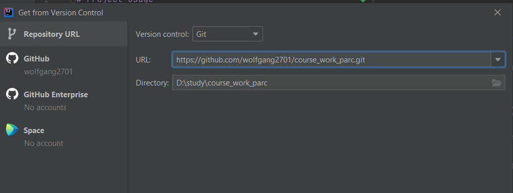
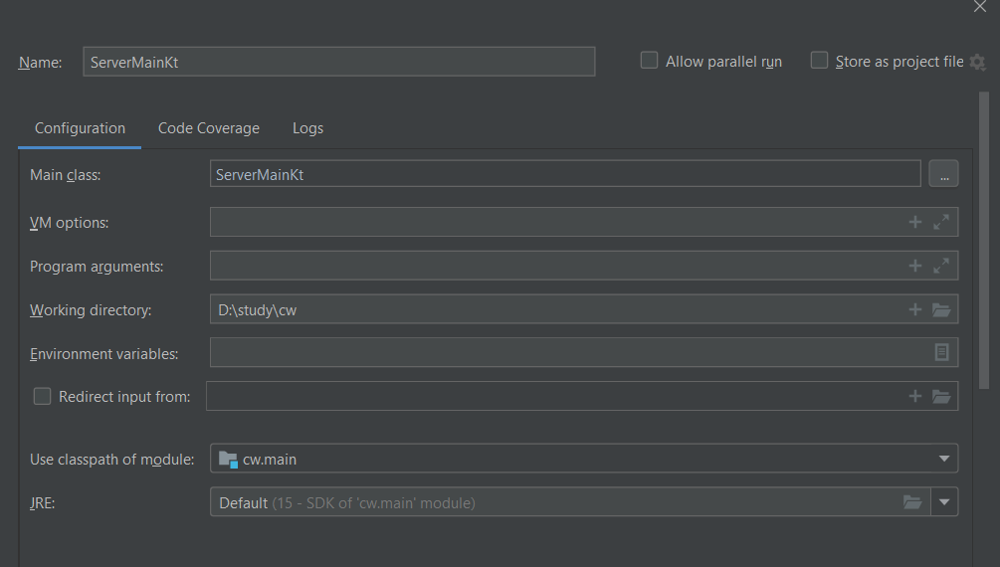
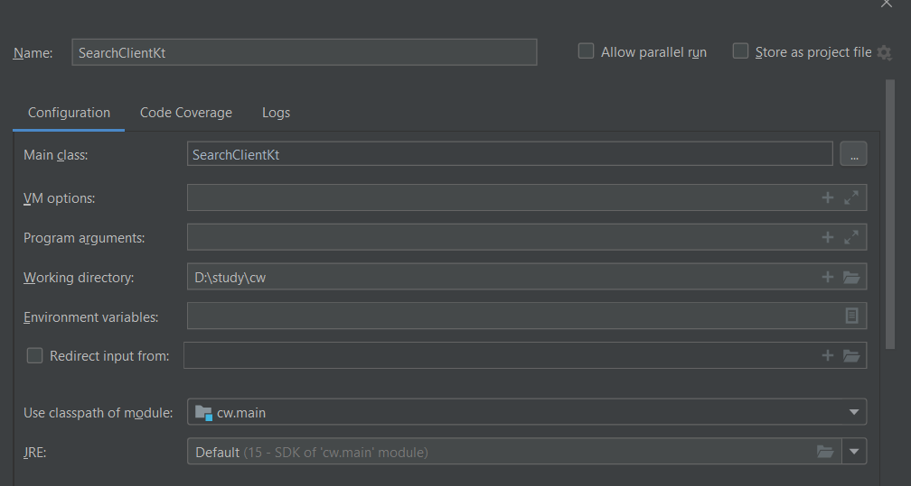

# Project usage
Firstly you should download and install the latest version of [IntelliJ IDEA](https://www.jetbrains.com/ru-ru/idea/download/#section=windows)

## Get a project from version control
1. From the main menu select **File|New|Project from version control** or **Git|Clone**
2. In the **Get from version control** window, specify the URL of this repository.

3. CLick Clone, then click Yes in the confirmation window (it will create a project based on the sources that we cloned).

## Add following build configuration
### For ServerMain.kt

### For SearchClient.kt

